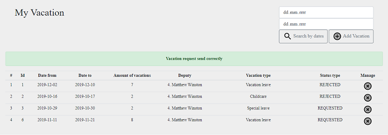

# Employee vacation calendar
> The application has been designed as internal vacation management system for companies. It is based on vacation requests send from employees to be considered and responded by management.

## Table of contents
* [General info](#general-info)
* [Features](#features)
* [Technologies](#technologies)
* [Status](#status)
* [Inspiration](#inspiration)
* [Contact](#contact)

## General info
The main feature of the application is vacation requests and responses system. An registered user can request vacations in amount and dates based on external conditions. The application has information about holidays that took place in a specific year and country provided by _Calendarific_ as an REST API. It also has information about employment duration of an employee so it can compute a bank of entitled vacation days. Management decides about accepting or rejecting requested vacation by using an admin panel. There are also features that are responsible for searching and presenting used data and statistics.

## Features

### User authentication and authorization
> Access to individual functionalities depends on the user's authorization, the application has three levels of authorization: 
guest, user and administrator.
The Google Oauth Authentication system has been added in the application, when the user exists in the database logs into 
his account, when he does not exist he is added to the database. 
By logging in, the user is checked the authorization level and access to individual functionalities.

### Calendar view with non-working days marked
> In the application, there is a calendar with holidays marked, where the date of holidays is taken from the online API. 
The current day is also marked on the calendar and it is also possible to enlarge the given month.

### Employees defining
 
> Management using an admin panel can add/edit/delete employees. Adding and editing an employee are using a pop-up form. Given data is saved to the database using REST API. Edited employee data is being get from database and put into form fields for further edition. Deletion of an employee is achieved without reloading the page. These features also use AJAX. There are also Hibernate Validators set on the database, to not put there wrong data. User is being informed about wrong entries in particular fields. There are additional validations on backend (those, which are not supported by Hibernate Validator) and frontend. If an operation ends with success there is an appropriate self-hiding information too. An employee with Id = 1 is a super admin and cannot be edited nor deleted.

### Teams defining
 
> Team defining feature is quite similar with employee defining one. There is one additional feature checking that a team containing employees cannot be deleted.

### Vacation manager

> Each administrator in his view has the ability to accept or reject vacations reported by employees. After pressing the accept/reject button, the data are updated via REST API, the request type is changed to accepted/rejected and an e-mail is sent to the employee with information about the change in the status of his/her leave. The strategy pattern has been used to build e-mails.

### Load holidays from JSON file

> In the administrator's management panel there is a functionality that allows you to read holiday data from the JSON file. All data are stored in MySQL database after loading. This functionality has been implemented as an alternative to retrieving holiday data directly from the API.

### Vacation defining

> After logging in as a user we can report a vacation by clicking on the add vacation button. Each employee has the opportunity to apply for leave and must fill in the fields that appear on the pop-up form after giving the range of dates, it is required to give the type of leave that the employee defines and optional giving the alternate while the employee will be on leave. You can also delete a given holiday that was reported data, at this time the data will be deleted by sending a request through AJAX and permanently deleted from the MySQL database. The whole process of reporting a holiday is properly validated against incorrect data entered by the employee.  After a correct operation, an e-mail is sent to the administrator about the reported leave, all data is recorded in the MySQL database. The strategy pattern has been used to build e-mails.

### Planned vacations view
 
> An employee can check all vacations that are requested in his team. On a special view there is a list of all employees in a particular team. A manager that has an admin role is marked by a star. Below that list there is a list containing all vacations of team employees which is also marked on a calendar. Vacation data can be filtered by date. Informations on calendar are get from backend and are served using Javascript. There is a my-not my division in which my vacation days are overriding my teammates vacation days. Every holiday and every weekend are taken into account when coloring a calendar.

### E-mail scheduler

> In the background of our application there is a scheduler that sends an e-mail with a list of reported leaves to the administrator if there are reported leaves that are older than 15 minutes.

### Loggers
> Every operation that is being made on the backend is logged to server logs or to external file - depending on the logger level.

## Technologies
* Java SE 12
* Java EE 8
* MySQL 8.0.15
* Hibernate ORM 5.4.2
* Hibernate Validator 6.0.17
* FasterXML/Jackson 2.9.10
* REST API
* Docker
* Wildfly 17.0.1
* Maven 3.3.9
* Jenkins CI/CD
* ECMAScript 6
* OAuth 2.0
* SLF4J 1.7.28
* Freemarker 2.3.29
* Bootstrap 4.3.1
* HTML5, CSS3, JS
* jQuery, AJAX

## Status
Project is: _finished_.

## Inspiration
The project has been created during a Java course at infoShare Academy in Gdańsk.

## Contact
Created by a course team gitLoopers, 2019.

GitLoopers are:

[@Arkadiusz Dąbkowski](https://github.com/ArkadiuszDabkowski)

[@Maciej Dzieciuch](https://github.com/MaciejDzieciuch)

[@Paweł Idek](https://github.com/pawelidek)

[@Marek Sitarski](https://github.com/marsitar)
